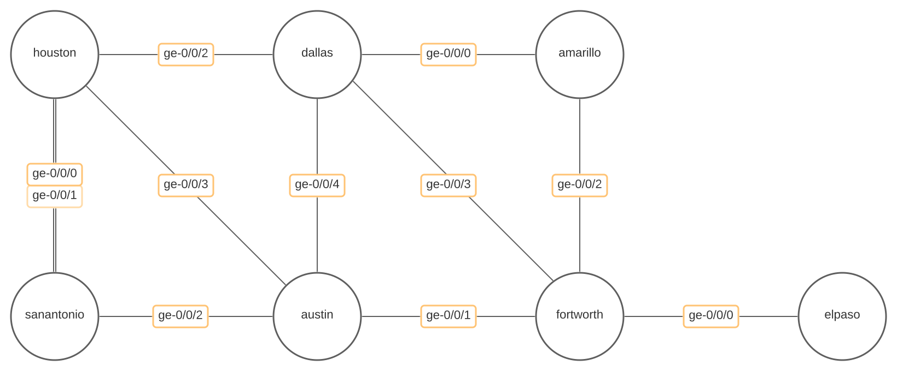

# MPLS L3VPN with Ansible

An EVE-NG lab based on an MPLS L3VPN service provider network running Juniper vMX routers.

## Lab Topology

Routing technologies used

- IS-IS
- iBGP
- MPLS
- RSVP

[](https://juniper.net/)

## Project Layout

Here is where you can locate the relevant files nested within the `files/` directory. Many of these components are still being worked on.

``` bash
`--> tree -L 3
.
├── files
│   ├── ansible
│   │   ├── ansible.cfg
│   │   ├── collections
│   │   ├── inventory.yaml
│   │   └── pb.configure.yaml
│   ├── configurations
│   │   ├── after
│   │   └── before
│   ├── docker
│   ├── docs
│   ├── eveng
│   │   └── lab.zip
│   └── images
│       └── mpls-l3vpn.svg
├── LICENSE
├── poetry.lock
├── pyproject.toml
└── README.md

```

## Automation

We will be leveraging Ansible to provision our environment.